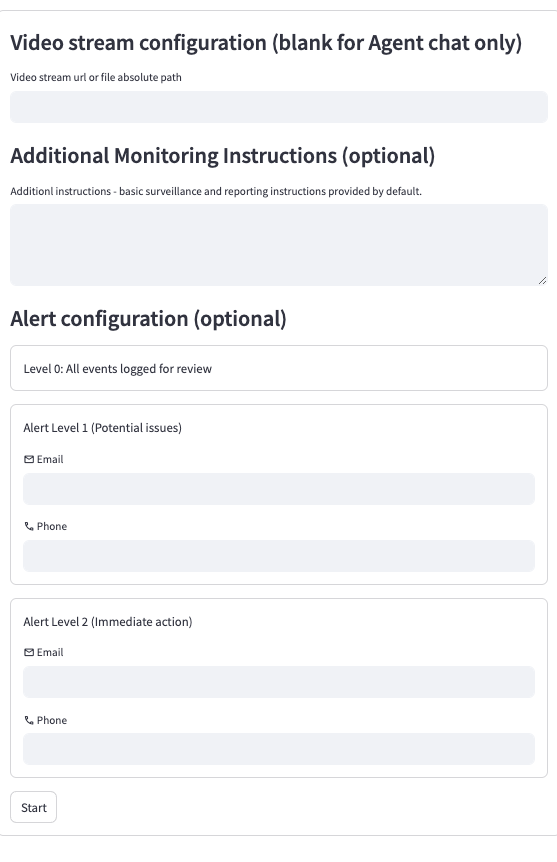
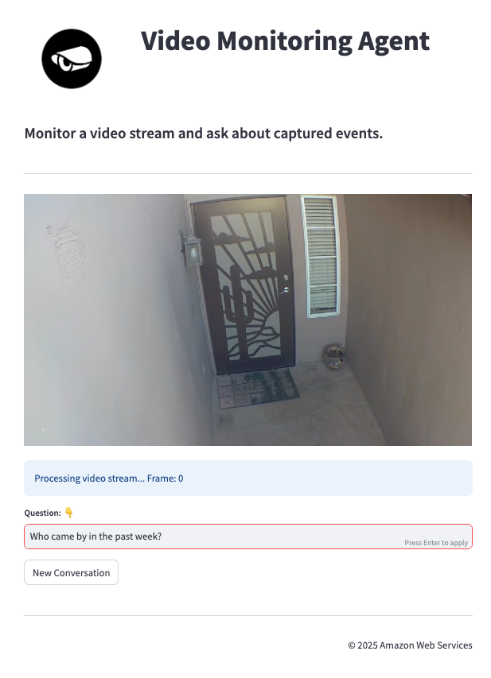

# Agents as Escalators: Real-time AI Video Monitoring with Amazon Bedrock Agents and Video Streams


Video Stream Monitoring Agent, a deployable solution which leverages a multimodal LLM to monitor video streams, and directs an Agent to take action in response to events detected in real-time. Potential applications include (i) monitoring video streams for safety and security issues, (ii) business specific video monitoring and logging, (iii) providing searchable semantic event memory while (iv) mitigating alert fatigue. 

This solution
1. **Analyzes detected motion** in input video stream or file using MLLM
2. **Alerts** of concerning activity based on instruction
3. **Keeps memory** of past events for reference and analysis


## Table of Content

- [User Interface](#user-interface)
- [Deployment](#deployment)


## User Interface





### Video Sources

The application supports two types of video sources:

1. **Live Video Streams**
   - Supports M3U8 stream URLs
   - Example sources:
     - Places like  [Livebeaches](https://www.livebeaches.com/) and [Skyline Webcams](https://www.skylinewebcams.com) provides many public streams
     - Use an online M3U8 player like [livepush](https://livepush.io/hlsplayer/index.html) to verify the stream URL
     - Example: Ocean City, MD Boardwalk Cam
       ```
       # Chrome may have issues displaying the video in the UI - if so try a different browser
       https://58bdb48e25cf1.streamlock.net:19350/live/vcmd001.stream/playlist.m3u8
       ```
       

2. **Local Video Files**
   - Supports common video formats (mp4, avi, etc.)
   - Sample event videos are provided under `assets/sample_event_video/`
   - Recommended for testing as events can be isolated and controlled

3. **No Input**
    - Connects with Agent in chatmode only, without video processing

**Note**: For testing and development, using local video files is recommended as:
- Events can be isolated and controlled
- Processing behavior is more predictable
- Easier to verify system functionality

### Configuration Options

| Field                    | Description                                    | Required |
|--------------------------|------------------------------------------------|----------|
| Video Stream URL         | URL or file path to video stream              | Yes      |
| Monitoring Instructions  | Custom instructions for video monitoring       | No       |
| L1 Alert Configuration   | Email/Phone for potential issues              | No       |
| L2 Alert Configuration   | Email/Phone for immediate action required     | No       |

## Deployment
### *** Before deployment you will need the following

1. Use **"us-west-2"** or **"us-east-1"** regions
    - run ```aws configure``` or set the ```~/.aws/credentials``` file
2. **Enable access to all Bedrock models** (Console > Bedrock > Model Access > "Enable all models").
3. Check if you have dependencies by running the below checks: 
```bash
    aws --version
    git --version
    npm --version
    docker --version
```

4. Install any missing dependencies
    - https://docs.aws.amazon.com/cli/latest/userguide/getting-started-install.html
    - https://git-scm.com/downloads
    - https://nodejs.org/en/download
    - https://www.docker.com/


## You are now ready to deploy the CDK app and run streamlit

Thre 4 lines below do the following:
1. Clones the repository and navigates into the folder
2. Sets up a virtual environment and installs dependencies
3. Deploys AWS resources (this takes 10–15 minutes)
4. Runs the streamlit app


```bash
$ git clone git@ssh.gitlab.aws.dev:kvs-agent/kvs-monitoring-agent.git && cd kvs-monitoring-agent
$ python3 -m venv .venv && source .venv/bin/activate && pip install -r requirements.txt
$ cdk bootstrap && cdk deploy
$ cd src/streamlit_app && streamlit run app.py
```

On Windows, replace the second line with:

```bash
python3 -m venv .venv && % .venv\Scripts\activate.bat && pip install -r requirements.txt
```

To destroy AWS resources:


```bash
$ cdk destroy
```


## Resources created


1. S3 Buckets
    - Assets
    - Query results
2. Bedrock
    - Bedrock Agent
    - Bedrock Knowledgebase
3. Lambdas
    - Action
    - Invoke
    - Update
4. Database
    - Athena DB
    - Glue Crawler
