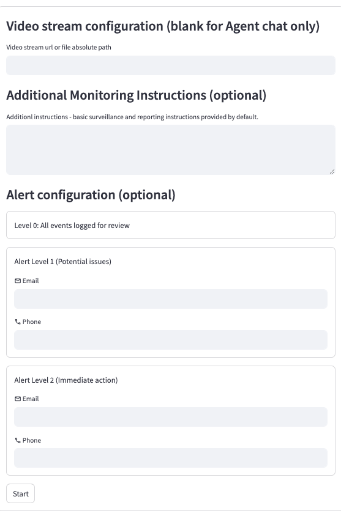
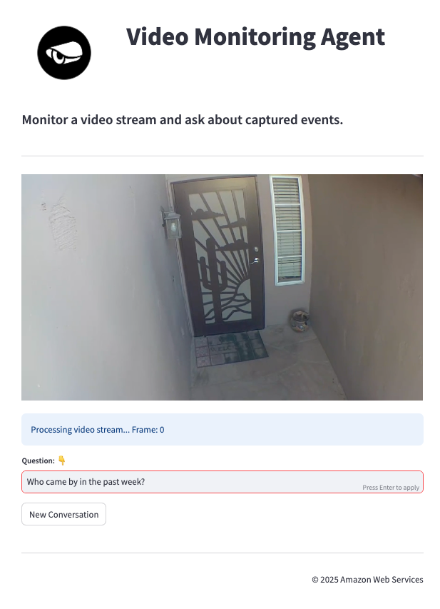

# Video Monitoring Agent & Chatbot

## Introduction

This application provides a Streamlit-based user interface for video stream monitoring and analysis using AWS services. It processes video streams in real-time through a flexible, modular processing pipeline that can be easily extended with custom processors.

The current implementation includes basic motion detection, but the pipeline architecture allows for easy integration of additional processing steps such as image segmentation, object detection, optical character recognition (OCR) etc.

The pipeline is built on a mini-framework that:
- Allows definition of video processing pipelines using simple building blocks
- Supports concurrent processing with multiple Python processes
- Provides clean interfaces for adding new processing nodes
- Can integrate with any downstream service (currently configured for AWS Lambda)

In the current implementation, processed frames are:
1. Captured from video stream using OpenCV
2. Analyzed for motion detection
3. Sampled and aggregated into grids
4. Stored in S3
5. Processed by an AWS Lambda function that invokes a Bedrock agent

This modular approach makes it easy to modify the pipeline for different use cases by adding, removing, or modifying processing nodes.

## Features

- Real-time video stream processing
- Motion detection and frame sampling
- Grid-based frame aggregation
- S3 storage integration
- Interactive chatbot for video analysis
- Multi-level alert configuration
- Multi-threaded video processing

## Component Details

### Prerequisites

- Python 3.10+
- AWS credentials configured
- Required Python packages installed

### Technology Stack

- [Streamlit](https://streamlit.io/)
- [OpenCV](https://opencv.org/)
- [AWS Lambda](https://aws.amazon.com/lambda/)
- [Amazon S3](https://aws.amazon.com/s3/)
- [Amazon SNS](https://aws.amazon.com/sns/)

### Package Structure

| Files/Directories               | Description                                                     |
|--------------------------------|-----------------------------------------------------------------|
| [app.py](app.py)               | Main entry point and configuration interface                     |
| [pages/](pages/)               | Additional Streamlit pages including video analysis interface    |
| [shared/](shared/)             | Shared utilities, processors, and core logic                    |
| [connections.py](connections.py)| AWS service connection management                               |
| [domain.py](domain.py)         | Domain models and configuration                                 |
| [utils.py](utils.py)           | Utility functions                                               |

### Configuration Options

| Field                    | Description                                    | Required |
|--------------------------|------------------------------------------------|----------|
| Video Stream URL         | URL or file path to video stream              | Yes      |
| Monitoring Instructions  | Custom instructions for video monitoring       | No       |
| L1 Alert Configuration   | Email/Phone for potential issues              | No       |
| L2 Alert Configuration   | Email/Phone for immediate action required     | No       |

### Installation

1. Clone the repository
2. Install required packages:
```bash
pip install -r requirements.txt
```

Run Locally
    
streamlit run app.py
       
### Usage

1. Launch the application using the command above
2. Configure video stream and monitoring settings
3. Start video analysis
4. Use the chat interface to ask questions about the video stream

### User Interface




### Architecture

The application uses a multi-threaded architecture for video processing:

- Main thread handles the UI and user interactions
- Separate threads for video capture and frame processing
- Multiple processors handle different aspects of frame analysis
- AWS services integration for storage and analysis

### Development

The application can be extended by:

- Adding new frame processors in `shared/processors.py`
- Creating additional Streamlit pages in `pages/`
- Enhancing the chat interface in `chat_video_analysis.py`
